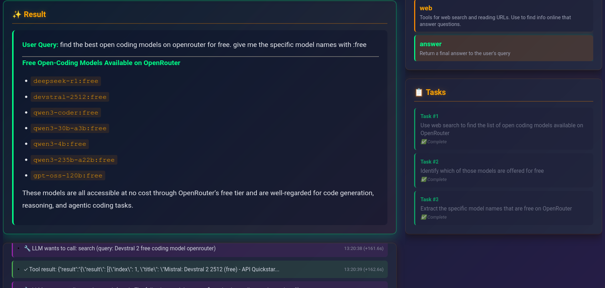

# Agent Skills Framework

AI agent framework implementing the [Agent Skills specification](https://agentskills.io). Break complex questions into tasks, use web search, and compile researched answers.



## Quick Start

```bash
git clone https://github.com/randerzander/skill-agent.git
cd skill-agent
pip install -r requirements.txt
cp .env.example .env
# Add your OPENROUTER_API_KEY to .env
python app.py  # Web UI at http://localhost:10000
```

## Features

- **Progressive Disclosure**: Skills load on-demand to save context
- **Web Search & Research**: Built-in web browsing and information gathering
- **Task Decomposition**: Break complex queries into subtasks
- **Real-time UI**: Watch agent work with live execution logs
- **OpenAI Tools**: Standard function calling for skill execution

## Configuration

`.env` file:
- `OPENROUTER_API_KEY` - Required for LLM access
- `GITHUB_TOKEN` - Optional, for authenticated GitHub requests (5000 req/hr vs 60/hr)

`config.yaml`:
- Model selection (default: nvidia/nemotron-3-nano-30b-a3b:free)
- System prompt customization
- Enabled skills whitelist

## Creating Skills

Create a `skills/my-skill/SKILL.md`:

```markdown
---
name: my-skill
description: When to use this skill
---

# My Skill

Instructions for the agent...
```

Optional: Add `scripts/tools.py` with Python functions that become tools.

## Documentation

- [Web Frontend Guide](docs/WEB_FRONTEND_GUIDE.md) - Detailed UI documentation
- [Agent Skills Spec](https://agentskills.io) - Official specification
- [Test Scripts](tests/README.md) - Testing documentation

## Testing

```bash
python tests/test_framework.py      # Main test suite
python tests/test_github_token.py   # Test GitHub authentication
```

## Evaluation

```bash
python eval.py -n 10  # Run on 10 test questions
```

## License

MIT
